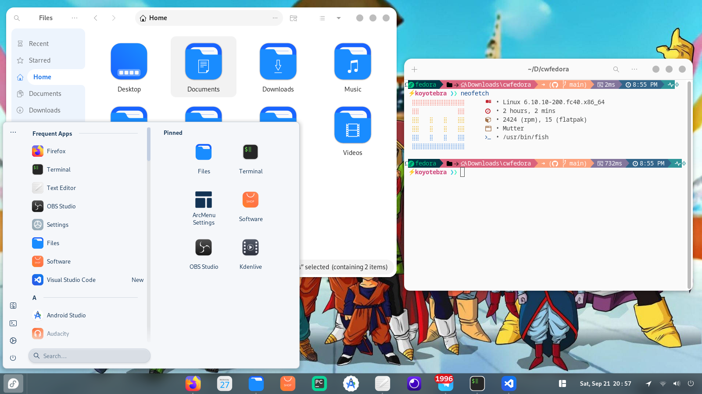

---

# Custom Fedora 40

## Theme Preview



## Install Dependencies
```bash
$ sudo dnf install curl
$ sudo dnf install git
$ sudo dnf install fsync
```

## Install GNOME Extensions
```bash
$ unzip -o $HOME/Downloads/cwfedora/gnome-extensions.zip -d $HOME/.local/share/gnome-shell/
```

## Install GTK Theme
```bash
$ mkdir -p $HOME/.themes
$ unzip -o $HOME/Downloads/cwfedora/GTK-Themes.zip -d $HOME/.themes
```

### Light Theme
```bash
$ ln -sf $HOME/.themes/Orchis-Light/gtk-4.0/{assets,gtk.css,gtk-dark.css} $HOME/.config/gtk-4.0/
```

## Install Icon Theme
```bash
$ mkdir -p $HOME/.local/share/icons
$ unzip -o $HOME/Downloads/cwfedora/icon-themes.zip -d $HOME/.local/share/icons
```

## Install Cursors Theme
```bash
$ mkdir -p $HOME/.icons
$ unzip -o $HOME/Downloads/cwfedora/cursors-theme.zip -d $HOME/.icons
```

## Install Fonts
```bash
$ unzip -o $HOME/Downloads/cwfedora/fonts.zip -d $HOME/.local/share/
```

## Install Cava Audio Visualizer
```bash
$ sudo dnf install cava -y
$ unzip -o $HOME/Downloads/cwfedora/cava-config.zip -d $HOME/.config/
```

## Install Neofetch
```bash
$ sudo dnf install neofetch -y
$ unzip -o $HOME/Downloads/cwfedora/neofetch-config.zip -d $HOME/.config/
```

## Install Fish Shell and Oh My Posh
```bash
$ sudo dnf install fish -y
$ chsh -s /usr/bin/fish

$ sudo wget https://github.com/JanDeDobbeleer/oh-my-posh/releases/latest/download/posh-linux-amd64 -O /usr/local/bin/oh-my-posh
```

### Make Binary Executable
```bash
$ sudo chmod +x /usr/local/bin/oh-my-posh
```

### Fish Oh My Posh
```bash
$ unzip -o $HOME/Downloads/cwfedora/fishomp-config.zip -d $HOME
$ chmod u+rw ~/.poshthemes/*.json
```

## Install Flatpak Applications
```bash
$ flatpak install flathub io.bassi.Amberol -y
$ flatpak install flathub net.agalwood.Motrix -y
$ flatpak install flathub com.rafaelmardojai.Blanket -y
$ flatpak install flathub com.github.KRTirtho.Spotube -y
$ flatpak install flathub com.mattjakeman.ExtensionManager -y
```

## Enable Orchis GTK Theme
```bash
$ sudo flatpak override --filesystem=$HOME/.themes
$ sudo flatpak override --filesystem=$HOME/.local/share/icons
$ sudo flatpak override --filesystem=xdg-config/gtk-4.0
```

## Install GNOME Applications
```bash
$  sudo dnf install gnome-weather gnome-maps gnome-calendar gnome-clocks gnome-connections gnome-console gnome-contacts gnome-music vlc  -y

```

## Fedora Desktop Settings
```bash
$ unzip -o $HOME/Downloads/cwfedora/fedora-desktop-settings.zip -d $HOME/Downloads/
$ dconf load / < $HOME/Downloads/fedora-desktop-settings.conf
```

---

